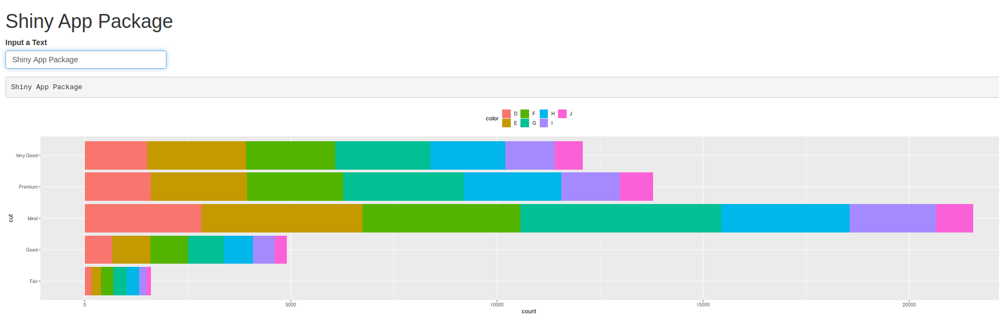
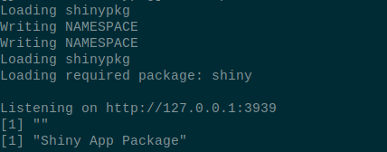

# shinypkg

<!-- badges: start -->

<!-- badges: end -->

The goal of shinypkg is to demonstrate how to wrap a shiny dashboard application into a nice package using [golem](https://github.com/ThinkR-open/golem)

## Run the app/package

1. The app can be run from source code using:-  
  a. `Rscript dev/run_dev.R`  
  b. `sh run.sh`  
  Given that above two commands are run on terminal open at base directory with app files.  

1. The app can be installed as a package by running below pieces of code on terminal:-  
  a. `sh install.sh` Given that terminal is open on base directory with app files.  
  b. `Rscript -e "golem::document_and_reload(pkg = '/path/to/app/files/directory'); devtools::install(pkg = '/path/to/app/files/directory')"`. This command can be run from anywhere on the terminal. However, app directory path must be specified as show above.  

1. After installation, the package can be started by running `Rscript -e "shinypkg::run_app()"` on terminal open in any directory provided the app was installed using any method illustrated in item 2. above.  

1. Once the app is ready, on the terminal used to run the app, the package generates an output **Listening on http://127.0.0.1:3939** after some other text is printed out. Navigate the app by pasting url [http://127.0.0.1:3939](http://127.0.0.1:3939) into any browser tab.  

1. Browser and terminal outputs should look like below images respectively. Note that both images show input text on browser!  

